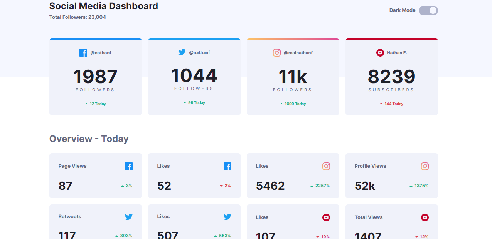
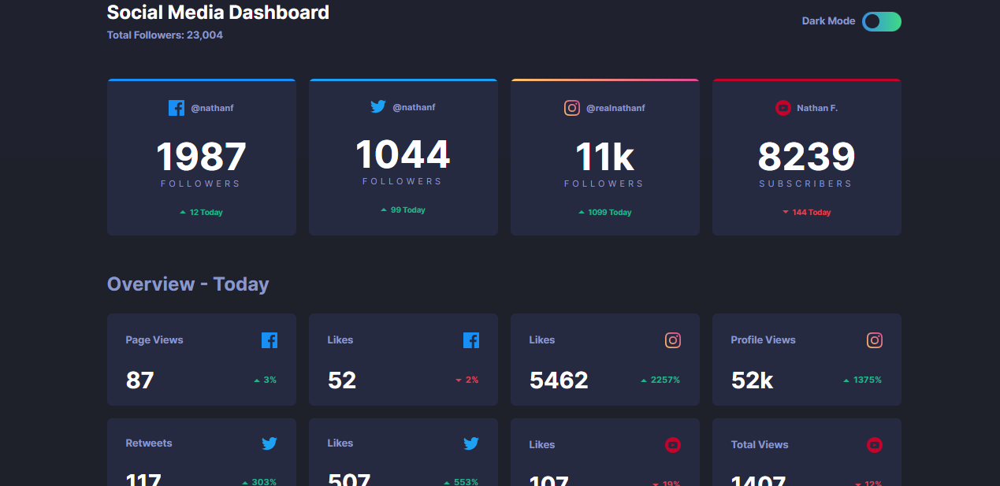
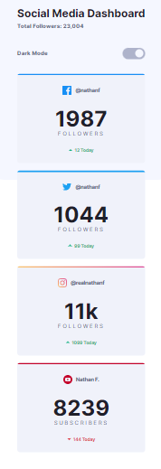
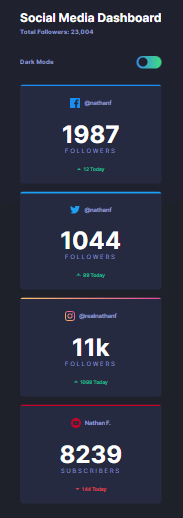

# Frontend Mentor - Social Media Dashboard

## Descripción general

Este fue un desafío de práctica de Frontend Mentor para mejorar las habilidades en diseño web.

### Reto

El reto fue resuelto con html, css y JavaScript practicando el cambio de tema en la página.

### Captura de pantalla

### Links

- URL del Sitio: [Sitio Web](https://danilovaron.github.io/Social-media-dashboard/)

## Proceso

Hice la semántica correspondiente de html, teniendo en cuenta las buenas practicas que conlleva el código. luego comencé con el diseño de la página, intentando comentar para que todo estuviera ordenado, además realice el modo responsivo de la página y el modo oscuro.

### Construido con

- Marcado semántico HTML5
- Propiedades personalizadas de CSS3
- Lenguaje JavaScript

## Autor

- Sitio Web - [Portafolio Personal](https://danilovaron.github.io/Portafolio/)
- Git Hub - [@Git Hub](https://github.com/DaniloVaron)
